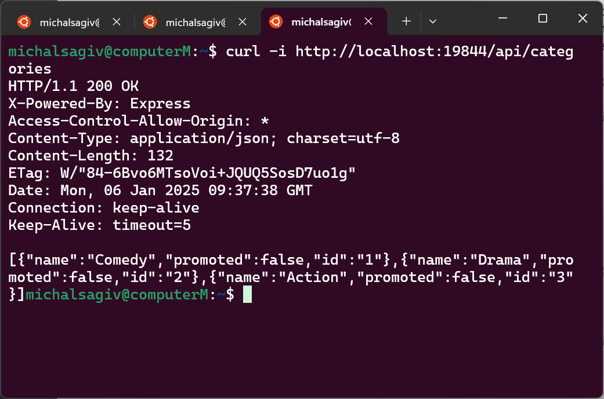

# Netflix Project

## Overview
This project provides a multi-functional movie management system comprising two main servers: a **C++ Server** for command-line-based movie recommendations and a **Web Server** built with Node.js, following the **MVC architecture**. 
The web server communicates with MongoDB for persistent data storage and integrates with the C++ server for additional functionality, such as updating user watch history.

## Execution Examples

<table>
  <tr>
    <td>
      
    </td>
    <td>
      
    </td>
    <td>
      
    </td>
  </tr>
</table>

## Installation and running

### 1. Clone Repository
```bash
git clone https://github.com/nikgrbn/netflix-project.git
cd netflix-project
```

### 2. Build Docker Image
```bash
docker-compose build
```

### 3. Start Movie Recommendation System

### Run c++ Server with Custom Port
```bash
docker-compose run --rm --name c-server c-server 19845
```
### Run c++ Client
```bash
docker-compose run --rm client netflix-server 19845
```

### 4. Configure Environment
Create a configuration file `.env.production` in the `/web/config/` directory. We recommend to use this configuration:
```plaintext
MONGO_URI="mongodb://mongo:27017/netflix-db"
PORT=19844
MRS_IP="c-server"
MRS_PORT=19845
```

### 5. Launch Web Server
```bash
docker-compose -f docker-compose.yml run --rm --name web-server --service-ports web-server
```

### 6. Verify Setup
```bash
curl -i http://localhost:19844/api/categories
```

### Run Tests
```bash
docker-compose run --rm tests
```

### Separation of Assignments

To ensure clear evaluation and avoid overlap between tasks:

- **Assignment 2**: The code for Assignment 2 is maintained under the branch `part-2`. This branch contains all the functionality and files required for Assignment 2 and remains independent of any changes introduced in Assignment 3.

- **Assignment 3**: Code is in the `part-3` branch, building on Assignment 2.

## Features

### **C++ Server**
- Manages user watch history and provides movie recommendations through a CLI.
- Supports persistent data storage and handles multiple client requests with a **ThreadPool**.
- Command-Line Commands:
  - **`POST`**: Add movies to user history.
  - **`PATCH`**: Update user history by adding new movies only.
  - **`DELETE`**: Remove movies from user history.
  - **`GET`**: Fetch movie recommendations.
  - **`help`**: List available commands.

### **Web Server**
- RESTful APIs for user and movie management, built with the **MVC pattern** for scalability and maintainability.
- **User Management**: Create users, retrieve user details, and authenticate users.
- **Movie Management**:
  - Retrieve movies by categories, including recommendations and recently viewed.
  - Add, update, delete, or search for movies.
- **Category Management**: Create, update, delete, and retrieve categories.
- **Recommendations**: Fetch or add movie recommendations from/to the C++ server.
- Integration with the C++ server for seamless communication and watch history updates.

### **Data Handling**
- MongoDB for persistent data storage.
- API responses in **JSON** format with proper HTTP status codes for success and error handling.
- Appropriate HTTP status codes are used for success and error scenarios (e.g., `200 OK`, `201 Created`, `400 Bad Request`, `404 Not Found`).

### **Integration**
- The web server communicates with the C++ server for adding movies to user watch history. This integration ensures seamless interaction between the two systems.

---

## Prerequisites
- **Docker**
- **Node.js** and **MongoDB**


## Project Structure
- `client/`: Client-side logic and scripts (c++)
- `server/`: Server-side application code (c++)
  - `inc/`: Header files for commands, core logic, and utilities
  - `src/`: Source code implementation for commands, core components, and utilities
  - `tests/`: Unit tests using the Google Test framework
- `web/`: the core of the web application, structured following the MVC design pattern.
  - `controllers/`: handling HTTP requests, interacting with services, and returning responses.
  - `models/`: including database schemas and interactions, typically using Mongoose for MongoDB.
  - `routes/`: Maps HTTP endpoints to their respective controllers, defining the application's API structure.
  - `services/`: Contains business logic and reusable functions for interacting with models, APIs, or performing complex operations.
  - `utils/`: Provides utility functions and helper scripts used across the application.
- `app/`: The entry point of the application, initializing the server, middleware, routes, and database connection.

## Development Approach
- Test-Driven Development (TDD)
- Modular and extensible architecture
- Continuous integration with feature branches

## Architecture and Extensibility

The system is modular, scalable, and designed for maintainability. It consists of:

1. **C++ Server**
   - Manages user watch history and provides recommendations via a CLI.
   - Communicates with the Web server for recommendations and watch history updates.
   - Ensures persistent storage of user data.

2. **Web Server**
   - Built with Node.js and Express, integrated with MongoDB.
   - Handles API requests for user, movie, and category management.
   - Communicates with the C++ server to update user history.
   - Organized into layers:
     - **Routes**: Define endpoints.
     - **Controllers**: Manage request and response logic.
     - **Services**: Encapsulate reusable logic and C++ server interactions.
     - **Models**: Define MongoDB schemas.

3. **Database**
   - MongoDB stores user, movie, and category data.
   - Optimized for efficient queries and scalability.

### Extensibility
- **Feature Expansion**: Easily add new APIs or logic without impacting existing code.
- **Client Integration**: Supports additional clients (e.g., mobile apps) through RESTful APIs.
- **Scalability**: Both servers and MongoDB can scale horizontally to handle larger loads.


 ## Additional Notes
- **`main.cpp`:**  
  Serves as the entry point for the C++ server, orchestrating server-side logic and execution. It initializes the necessary components and manages the main server loop.

- **Helper Utilities (`Config` and `Types`):**  
  These utilities provide modular and reusable components for managing configuration files and maintaining type consistency across the system. They ensure clean, readable, and maintainable code.

- **Command Implementation Using Interfaces:**  
  All commands in the system are implemented following the **interface-based design pattern**, which adheres to the **Open/Closed Principle** from SOLID principles. This design allows for the easy addition of new commands without modifying existing code, enhancing the system's extensibility and maintainability.

- **Loose Coupling Across Components:**  
  The project emphasizes **loose coupling** between modules, enabling independent development, testing, and scalability for both the C++ server and the web server.

- **ThreadPool Usage in C++ Server:**  
  The C++ server employs a **ThreadPool** to efficiently handle multiple client requests concurrently, ensuring high performance and responsiveness under heavy workloads.

- **Integration Between Web and C++ Servers:**  
  The web server communicates seamlessly with the C++ server for updating user watch history and fetching recommendations, leveraging RESTful APIs and a modular service-oriented architecture.
