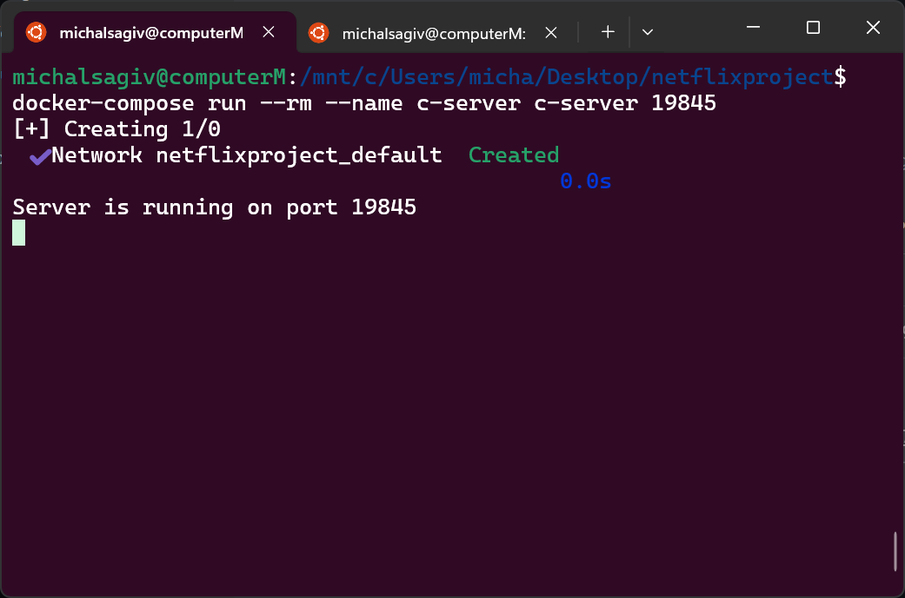
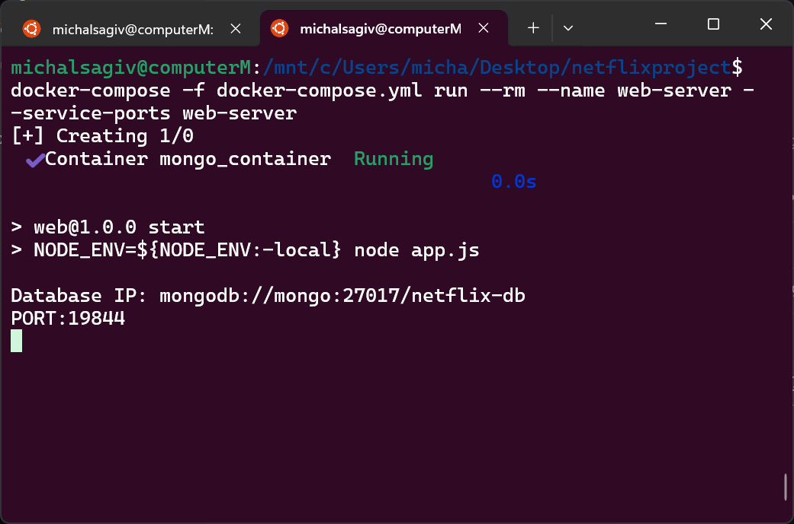
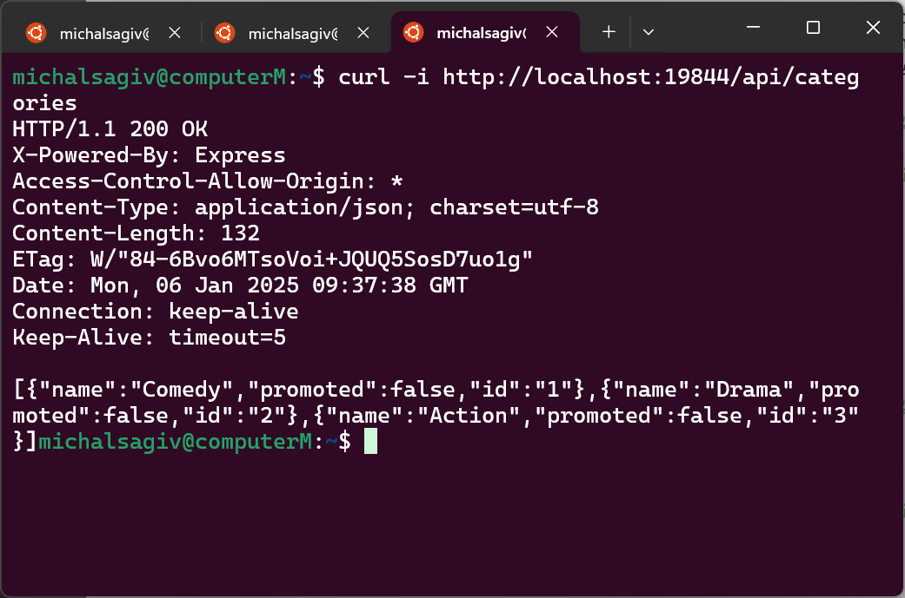

# Netflix Project

## Overview

This project provides a multi-functional movie management system comprising two main servers: a **C++ Server** for command-line-based movie recommendations and a **Web Server** built with Node.js, following the **MVC architecture**.
The web server communicates with MongoDB for persistent data storage and integrates with the C++ server for additional functionality, such as updating user watch history.

<table>
  <tr>
    <th>C++ Server</th>
    <th>Web Server</th>
    <th>HTTP Request</th>
  </tr>
  <tr>
    <td>
      
    </td>
    <td>
      
    </td>
    <td>
      
    </td>
  </tr>
</table>

## Prerequisites

- **Docker**
- **Node.js** and **MongoDB**

## Installation

To run front and backend on the same server, go to ` ./web`` and run  `npm run build-react`, then run `node app.js`.

### 1. Clone the repository

```bash
git clone https://github.com/nikgrbn/netflix-project.git
cd netflix-project
```

### 2. Build the Docker image

```bash
docker-compose build
```

### 3. Start Movie Recommendation System

Run c++ Server with Custom Port

```bash
docker-compose run --rm --name c-server c-server 19845
```

### 4. Configure Environment

Create a configuration file `.env.production` in the `/web/config/` directory. We recommend to use this configuration:

```plaintext
MONGO_URI="mongodb://mongo:27017/netflix-db"
PORT=19844
MRS_IP="c-server"
MRS_PORT=19845
```

### 5. Launch Web Server

```bash
docker-compose -f docker-compose.yml run --rm --name web-server --service-ports web-server
```

### 6. Test

#### Send request to Web server

```bash
curl -i http://localhost:19844/api/categories
```

#### Run Tests on C++ server

```bash
docker-compose run --rm tests
```

#### Run C++ Client

```bash
docker-compose run --rm client c-server 19845
```

---

## Features

### **C++ Server**

- Manages user watch history and provides movie recommendations through a CLI.
- Supports persistent data storage and handles multiple client requests with a **ThreadPool**.
- Command-Line Commands:
  - **`POST`**: Add movies to user history.
  - **`PATCH`**: Update user history by adding new movies only.
  - **`DELETE`**: Remove movies from user history.
  - **`GET`**: Fetch movie recommendations.
  - **`help`**: List available commands.

### **Web Server**

- RESTful APIs for user and movie management, built with the **MVC pattern** for scalability and maintainability.
- **User Management**: Create users, retrieve user details, and authenticate users.
- **Movie Management**:
  - Retrieve movies by categories, including recommendations and recently viewed.
  - Add, update, delete, or search for movies.
- **Category Management**: Create, update, delete, and retrieve categories.
- **Recommendations**: Fetch or add movie recommendations from/to the C++ server.
- Integration with the C++ server for seamless communication and watch history updates.

### **Data Handling**

- MongoDB for persistent data storage.
- API responses in **JSON** format with proper HTTP status codes for success and error handling.
- Appropriate HTTP status codes are used for success and error scenarios (e.g., `200 OK`, `201 Created`, `400 Bad Request`, `404 Not Found`).

### **Integration**

- The web server communicates with the C++ server for adding movies to user watch history. This integration ensures seamless interaction between the two systems.
